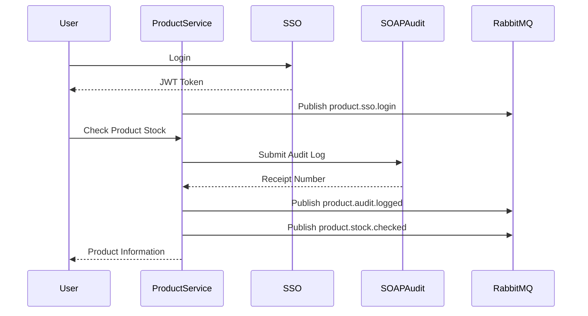

# Analisis Tugas 3

**Nama:** Noval Ariadi
**NIM:** 102022400271
**Layanan:** Product Stock Service

---

## 1. Analisis Transaksi Penting

Pada Product Stock Service, transaksi yang dianggap penting adalah proses pengecekan informasi produk dan stok barang. Informasi stok merupakan data yang berpengaruh terhadap proses bisnis lain seperti pemesanan, pengiriman, maupun pengelolaan inventori.

Setiap kali pengguna melakukan pengecekan produk atau stok, aktivitas tersebut perlu dicatat agar dapat dilakukan monitoring dan audit terhadap transaksi yang terjadi pada sistem.

Contoh transaksi penting:

* Melihat informasi produk
* Melihat jumlah stok produk
* Pengecekan ketersediaan produk

---

## 2. Penggunaan SOAP untuk Audit Log

Untuk mencatat aktivitas penting yang terjadi pada sistem, Product Stock Service terintegrasi dengan layanan audit terpusat menggunakan SOAP.

Ketika pengguna melakukan pengecekan produk, sistem mengirimkan log aktivitas ke layanan audit dengan informasi berupa:

* Team ID
* Nama aktivitas
* Informasi produk
* Jumlah stok

Contoh aktivitas yang dicatat:

```xml
ActivityName: ProductViewed
```

Tujuan penggunaan SOAP Audit:

* Menyimpan riwayat transaksi penting.
* Mendukung proses monitoring sistem.
* Mempermudah proses audit dan pelacakan aktivitas.

Hasil pengujian SOAP:

```xml
<iae:Status>SUCCESS</iae:Status>
<iae:ReceiptNumber>IAE-LOG-2026-D3014906</iae:ReceiptNumber>
```

---

## 3. Penggunaan RabbitMQ untuk Penyebaran Informasi

Selain dicatat pada sistem audit, informasi penting juga dipublikasikan menggunakan RabbitMQ agar dapat digunakan oleh layanan lain.

Event yang dipublikasikan:

* product.sso.login
* product.audit.logged
* product.stock.checked

Exchange yang digunakan:

```text
iae.central.exchange
```

Data event login SSO:

```json
{
  "nim": "102022400271",
  "email": "warga03@ktp.iae.id",
  "event": "login_success"
}
```

Data event audit:

```json
{
  "nim": "102022400271",
  "receipt_number": "IAE-LOG-2026-D3014906"
}
```

Data event pengecekan stok:

```json
{
  "nim": "102022400271",
  "product_id": 1,
  "product_name": "Keyboard Mechanical",
  "stock": 25
}
```

Tujuan penggunaan RabbitMQ:

* Menyebarkan informasi ke layanan lain secara asynchronous.
* Mendukung arsitektur event-driven.
* Mengurangi ketergantungan antar layanan.

Hasil pengujian RabbitMQ:

```json
{
  "status": "success",
  "exchange": "iae.central.exchange",
  "routing_key": "product.stock.checked"
}
```

---

## 4. Integrasi SSO

Product Stock Service menggunakan layanan Single Sign-On (SSO) yang disediakan oleh server pusat untuk proses autentikasi.

Metode autentikasi yang digunakan:

* User Authentication
* Machine-to-Machine (M2M) Authentication

Contoh hasil autentikasi:

```json
{
  "status": "success",
  "token_type": "m2m"
}
```

Token yang diperoleh digunakan untuk mengakses layanan SOAP Audit dan RabbitMQ Publish.

---

## 5. Sequence Diagram Internal



---

## 6. Kesimpulan

Product Stock Service telah berhasil mengimplementasikan integrasi dengan layanan terpusat yang disediakan pada praktikum Enterprise Application Integration (EAI), yaitu:

* REST API untuk layanan produk.
* GraphQL untuk akses data produk.
* SSO untuk autentikasi pengguna dan layanan.
* SOAP untuk audit aktivitas penting.
* RabbitMQ untuk penyebaran event antar layanan.

Implementasi RabbitMQ berhasil mempublikasikan tiga event yaitu:

* product.sso.login
* product.audit.logged
* product.stock.checked

Seluruh event berhasil diterima dan ditampilkan pada RabbitMQ Board yang disediakan oleh server pusat.

Seluruh pengujian menunjukkan status berhasil sehingga layanan telah memenuhi kebutuhan integrasi yang ditentukan pada Tugas 3.